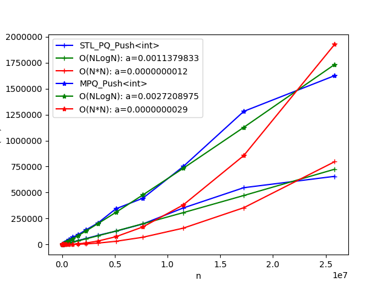
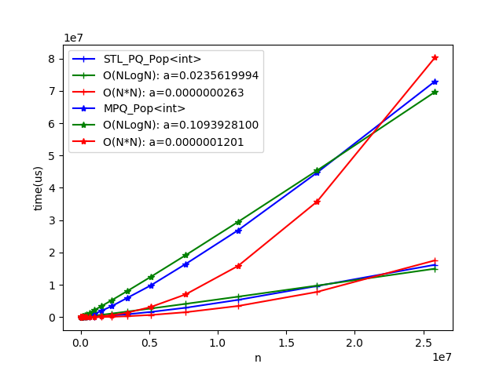
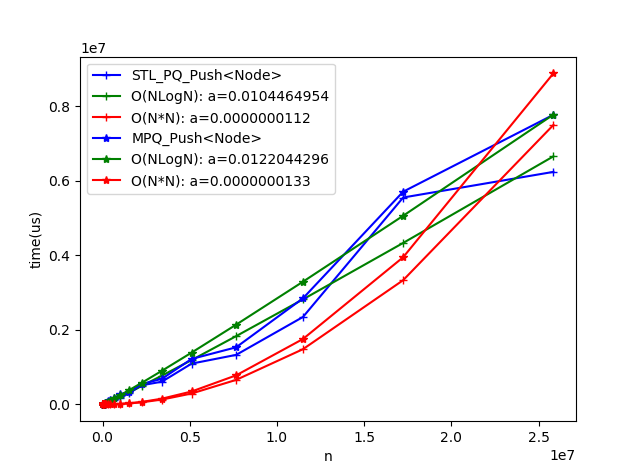
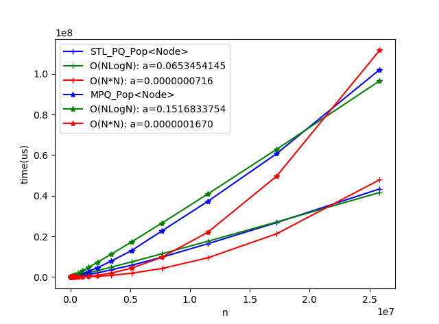

# MutablePriorityQueue
A mutable priority queue implement. Compared with std::priority_queue, you can update the value in queue by a handle(you get it when push). There is a mutable priority queue implement in boost, but boost is too heavy.

## Performance

Compare the push/pop performance of MutablePriorityQueue and std::priority_queue by pushing/poping n random data.

OS: Windows Subsystem for Linux(Ubuntu 16.04.9)  
CPU: Intel(R) Core(TM) i5-8250U @1.60GHz 1.80GHz  
Compiler: gcc version 5.4.0 20160609 (Ubuntu 5.4.0-6ubuntu1~16.04.9)  

1. Blue curve is the original data.
2. Green curve is the fitting curve using O(NLogN)
3. Red curve is the fitting curve using O(N*N)

push int:  
  
pop int:  
  
Node is:  
```
struct Node
{
    int value;
    char ext[80];
};
```  
push Node:  
  
pop Node:  
  
